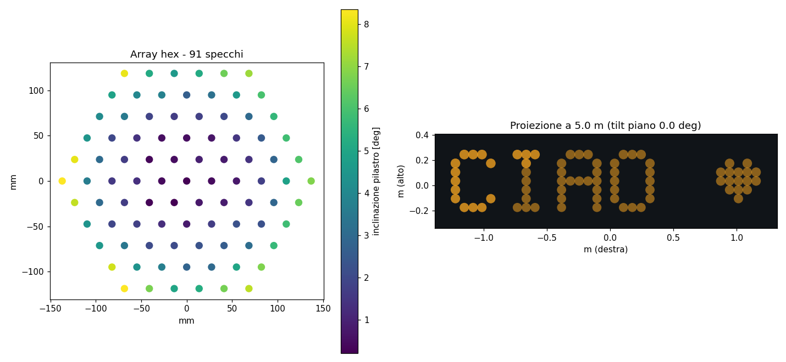

# Heliograph Studio

**[▶ Try it live](https://giscardo1.github.io/heliograph-studio/)** — no install, runs in your browser.

**Write messages with sunlight.** Design a 3D-printed mirror array — a panel of small mirrors,
each tilted at a precisely computed angle — that reflects the sun (or a spotlight) into glowing
dots of light spelling out a message on a wall, on the ground, or on the ceiling.

This project is a companion / add-on to Ben Bartlett's wonderful
[**3D-printed-mirror-array**](https://github.com/bencbartlett/3D-printed-mirror-array)
([blog post](https://bencbartlett.com/blog/3D-printed-mirror-array/)), which he built as a
marriage proposal: at sunset on his 8th anniversary, 196 mirrors spelled out *"MARRY ME?"* on
the ground. All code here is an independent implementation of the same geometry, extended into
a full design studio. Credit for the idea, the ring-matching insight and the tiling strategy
goes to him.



## What's inside

| Path | What it is |
|---|---|
| `webapp/index.html` | **The design studio** — a single self-contained HTML file. Open it in any browser (double-click, no server, no install). |
| `webapp/src/` | React source of the app (built with esbuild). |
| `tool/` | **The STL generator** — a Python package that takes the app's exported `config.json`, independently recomputes every mirror normal, cross-checks it against the app, and writes print-ready STL tiles + an assembly report. |

## The workflow

1. **Design** — open `webapp/index.html`. Set the light (real sun from date & location, or a lamp),
   the surface, the array, the text. The app simulates the projection live, with real photometry
   (spot size from solar divergence, smearing at grazing angles, contrast vs ambient light),
   physical checks (backlit / grazing / occlusion / body shadow) and a verified optimizer.
2. **Generate — right in the browser.** The *"Generate print files"* button produces a ZIP with the
   **print-ready STL tiles** (sized to your printer bed), a **step-by-step assembly guide**
   (`assembly-guide.html`, with a numbered mirror-mounting map generated for your exact design)
   and the `config.json`. Nothing else to install: design → download → print.
   The in-browser generator is a faithful port of the Python tool below — verified to produce
   **identical geometry** (same triangles, same bounding boxes to < 0.001 mm).
3. **(Optional) Independently verify** — the Python tool recomputes everything from scratch:
   ```bash
   cd tool
   python3 -m venv .venv && source .venv/bin/activate
   pip install numpy numpy-stl matplotlib pytest
   python -m pytest tests/            # 13 tests
   python generate.py ~/Downloads/config.json --bed 220x220 -o output/
   ```
   The tool recomputes all normals from scratch and refuses to proceed if they diverge from the
   app's (typical agreement: ~1e-16). Output: STL tiles sized to your print bed (seams only
   through the base, never through a pillar) plus `report.png` with the simulated projection and
   the numbered mirror-mounting map.
4. **Print & build** — see the *Materials & printing* page inside the app (mirror materials and
   reflectivity, non-expanding glue, layer heights, warping counter-measures, aiming).

## Physics in one line

A mirror reflects symmetrically, so its normal must bisect the direction of the light `v̂` and
the direction of its target dot `t̂`:  **n ∝ v̂ + t̂**. Everything else — solar position (NOAA),
ring-based target matching for parallel rays, hexagonal pillar geometry with mirror-aligner
tabs, bed tiling — serves that one equation.

## Development

The web app is a single JSX file bundled with esbuild:

```bash
cd webapp
npx esbuild src/heliograph-studio.jsx --bundle --minify --jsx=automatic \
  --define:process.env.NODE_ENV='"production"' --outfile=bundle.js
# then inline bundle.js into index.html (see .github/workflows or keep the shipped index.html)
```

Python tool: plain `numpy` + `numpy-stl` + `matplotlib`; tests with `pytest`.

## License

MIT — see [LICENSE](LICENSE). The idea and original implementation belong to
[Ben Bartlett](https://github.com/bencbartlett/3D-printed-mirror-array); this repository
contains an independent re-implementation and does not copy code from the original.
